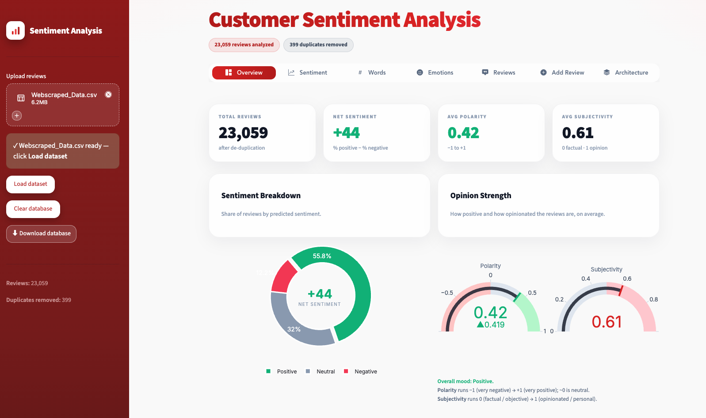
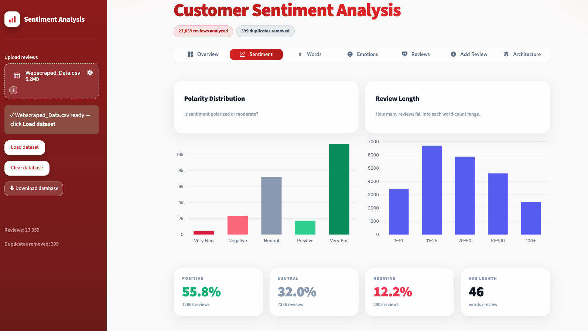
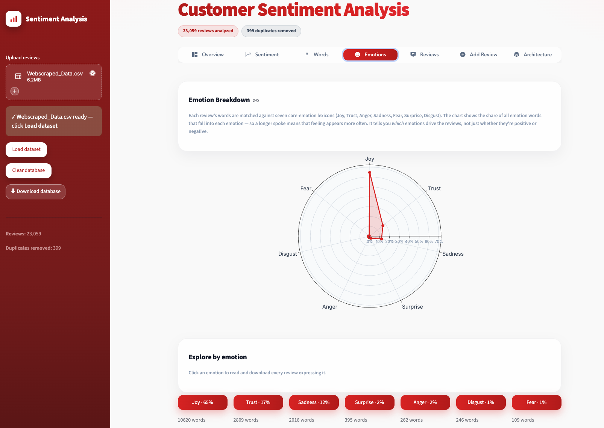
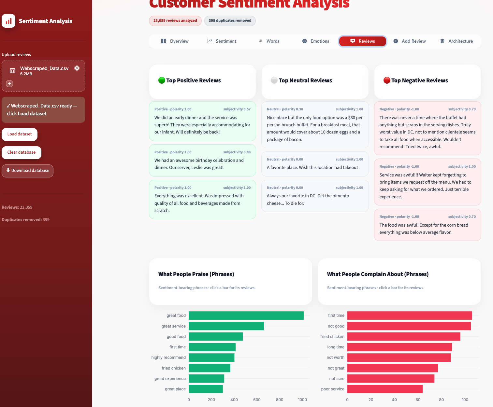

# Customer Sentiment Analysis

[](https://aadhavanalakan-customer-sentiment-analysis-app-app-fyfpik.streamlit.app)
[](LICENSE)
[](https://www.python.org/)

**🔴 Live demo:** <https://aadhavanalakan-customer-sentiment-analysis-app-app-fyfpik.streamlit.app>
**📄 Project write-up:** [docs/PROJECT_DOCUMENTATION.md](docs/PROJECT_DOCUMENTATION.md)

A single-page **Streamlit** dashboard that turns a CSV of customer reviews into
sentiment, emotion, keyword and phrase analytics — with interactive drill-downs
and one-click CSV export of any subset.

It's built as a **layered, swappable NLP pipeline** (the sentiment model sits
behind an abstract interface), so the lexicon backend can be replaced without
touching the analytics or UI.

> Sentiment is computed with a **noun-corrected TextBlob** model — fast, private,
> fully offline, and transparent. No API keys, no data leaves your machine.



---

## Features

- **Overview** — total reviews, net sentiment, average polarity & subjectivity,
  a sentiment donut, and polarity/subjectivity gauges with plain-language help.
- **Sentiment** — polarity distribution and review-length breakdown.
- **Words** — a sentiment-coloured word cloud, top keywords, and top phrases
  (bigrams). Brand/place names are auto-filtered. Click any bar to read & download
  the matching reviews.
- **Emotions** — a seven-emotion radar (Joy, Trust, Anger, Sadness, Fear,
  Surprise, Disgust). Click an emotion to read & download its reviews.
- **Reviews** — top positive / neutral / negative reviews, plus *what people
  praise* and *what people complain about* (sentiment-bearing phrases). Click a
  bar for the underlying reviews.
- **Add Review** — score a new comment instantly and append it to the database.
- **Architecture** — an in-app explanation of the pipeline and methodology.

### Notable engineering details

- **Noun-corrected sentiment** — TextBlob mis-scores some domain nouns (famously
  `chicken` = "cowardly", −0.6). The model recomputes polarity from per-word
  assessments and drops bare-noun misfires, so genuine praise isn't dragged
  negative — while real sentiment words (`delicious`, `terrible`, `cold food`)
  are kept.
- **Proper-noun filtering** — brand / restaurant / place names are detected by
  mid-sentence capitalisation and excluded from keywords and phrases.
- **Hybrid word-cloud colouring** — curated adjectives use their lexicon sign;
  other words are coloured only when standalone and in-context scores agree.
- **Interactive drill-down** — chart bars and emotion buttons open a popup of the
  exact matching reviews, each with a CSV download.
- **Caching** — model (`@st.cache_resource`) and analysis (`@st.cache_data`) are
  cached for fast, reproducible reruns.

---

## Screenshots

| Sentiment | Emotions |
| --- | --- |
|  |  |

**Reviews — top positive / neutral / negative + praise vs. complaints**



---

## Quickstart

### Option A — uv (recommended, reproducible)

```bash
uv sync
uv run streamlit run app.py
```

### Option B — pip

```bash
python -m venv .venv && source .venv/bin/activate   # Windows: .venv\Scripts\activate
pip install -r requirements.txt
streamlit run app.py
```

Then open <http://localhost:8501>, and use the sidebar to **upload a reviews CSV**
and click **Load dataset**. (TextBlob's PatternAnalyzer is bundled — no NLTK
corpus download is needed.)

### Input format

Any CSV with a column of review text. The app **auto-detects** the text column
(the one with the longest average content). Reviews you add are persisted to
`data/reviews.csv` and can be exported from the sidebar (**Download database**).

---

## Polarity classification

| Polarity score        | Label    |
| --------------------- | -------- |
| `< 0`                 | Negative |
| `0` to `0.4`          | Neutral  |
| `> 0.4`               | Positive |

(Thresholds live in `app.py` as `POS_T` / `NEG_T`.)

---

## Project structure

```
customer-sentiment-analysis/
├── app.py                  # the whole app — 7 layered sections (see header comment)
├── requirements.txt        # pip dependencies
├── pyproject.toml          # project metadata + deps (uv)
├── uv.lock                 # exact pinned versions (uv)
├── .streamlit/config.toml  # theme + server config
├── data/                   # data/reviews.csv (the live database) is gitignored
├── LICENSE                 # MIT
└── README.md
```

`app.py` is organised into seven swappable layers — **Config, Styling,
Preprocessing, Sentiment Model, Analytics Engine, Data Store, Serving** — so it
can later be split into a `src/` package without changing the logic.

---

## Tech stack

Streamlit · pandas · NumPy · Plotly · TextBlob · WordCloud · matplotlib ·
streamlit-option-menu · managed with **uv**.

---

## Limitations

A lexicon sentiment model doesn't fully capture sarcasm or niche slang. Treat the
scores as **directional indicators**, not ground truth. The model is intentionally
transparent and offline; swap in VADER or a fine-tuned transformer via the
`SentimentModel` interface if you need higher accuracy.

## License

[MIT](LICENSE) © 2026 Aadhavan Alakan
